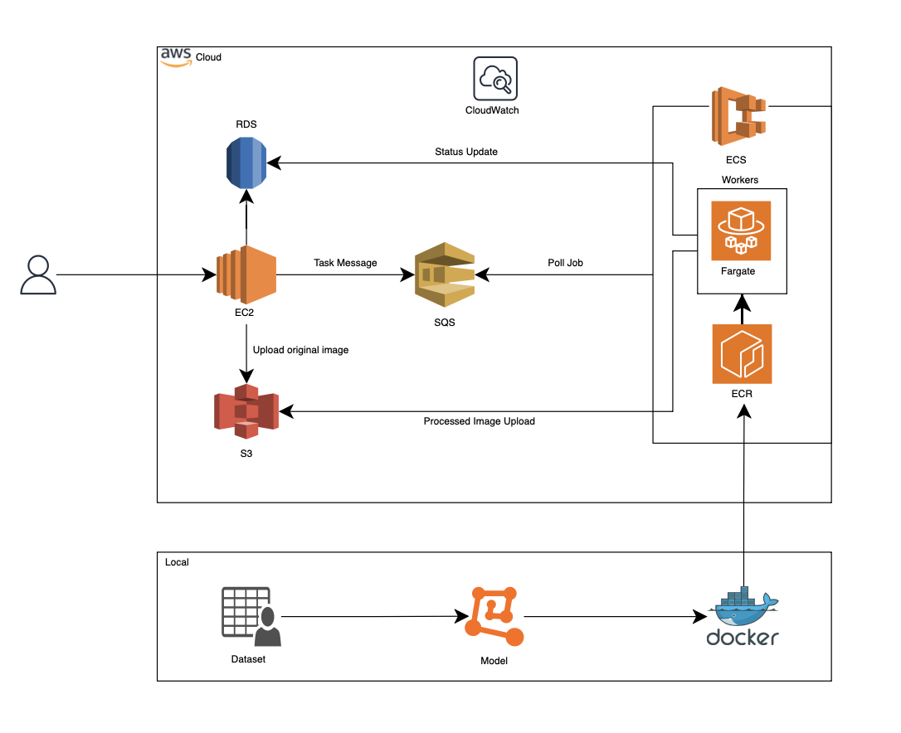

# Retinal Vessel Segmentation Pipeline

A scalable, event-driven pipeline for retinal image segmentation using AWS and containerized microservices.

---

## 🏗️ Architecture

---

## 🚀 Overview

- Upload images via API → stored in S3  
- Jobs queued using SQS  
- ECS Fargate workers process images using an ML model  
- Results stored back in S3 and tracked via DynamoDB  

---

## ⚙️ Tech Stack

Node.js, Express, React, AWS (S3, SQS, ECS, DynamoDB), Docker  

---

## 📊 Features

- Asynchronous queue-based processing  
- Scalable microservices architecture  
- Handles concurrent image requests 

---

## 👨‍💻 Author

Sanjay Sundar
